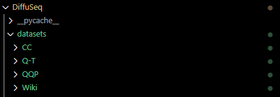
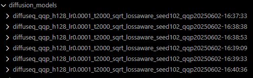

#  DiffuSeq

[*__*DiffuSeq*__: Sequence to Sequence Text Generation With Diffusion Models*](https://arxiv.org/abs/2210.08933) 와
[*__*DiffuSeq-v2*__: Bridging Discrete and Continuous Text Spaces for Accelerated Seq2Seq Diffusion Models*](https://arxiv.org/abs/2310.05793) 의 공식 코드의 한국어 번역본 입니다.

<p align = "center">

</p>
<p align = "center">
DiffuSeq의 조건부 확산 언어 모델에서의 확산 과정
</p>

<p align = "center">

</p>
<p align = "center">
가속화된 DiffuSeq의 확산 과정
</p>

## 주요 특징 (Highlights)
- 제안된 __*DiffuSeq*__ 모델은 분류기 없이(classifier-free) 훈련되는 조건부 언어 모델(Conditional Language Model) 입니다.
- AR (AutoRegressive), NAR (Non-AutoRegressive) 모델들과 __*DiffuSeq*__ 사이의 이론적 연관성을 수립했습니다. (자세한 내용은 논문 참조)
- __*DiffuSeq*__ 는 텍스트 생성에 있어 매우 강력한 모델로, **기존의 AR, 반복적 NAR, 대형 사전학습 모델(PLMs)** 들과 유사하거나 이를 능가하는 품질과 다양성을 보입니다.

이 연구는 새로운 시퀀스-투-시퀀스 학습 패러다임의 가능성을 보여주는 중요한 성과를 담고 있습니다.

<p align = "center">

</p>
<p align = "center">

</p>

업데이트: 향상된 버전인 __*DiffuSeq-v2*__ 는 훈련 수렴 속도를 4배 가속시키고, 800배 빠르게 유사한 품질의 샘플을 생성할 수 있습니다.

<p align = "center">

</p>

## 설치 방법 (Setup)
본 프로젝트는 PyTorch 와 HuggingFace `transformers` 라이브러리를 기반으로 작성되었습니다.
```bash 
pip install -r requirements.txt 
```

## Datasets
`datasets` 폴더 아래에 데이터를 준비합니다. 예를 들어 `datasets/CommonsenseConversation/train.jsonl` 에 준비합니다. 논문에서는 총 4개의 데이터셋을 사용합니다.

| 작업 유형 (Task) | 데이터셋 (Datasets) | 학습 샘플 수 (Training Samples) | 출처 (Source) | 다운로드
|-|-|-|-|-|
| 일반 대화 (Open-domain Dialogue) | Commonsense Conversation | 3382k | [CCM](https://github.com/thu-coai/ccm) | [download](https://drive.google.com/drive/folders/1exENF9Qc5UtXnHlNl9fvaxP3zyyH32qp?usp=sharing) |
| 질문 생성 (Question Generation) | Quasar-T | 117k | [OpenQA](https://github.com/thunlp/OpenQA) | [download](https://drive.google.com/drive/folders/122YK0IElSnGZbPMigXrduTVL1geB4wEW?usp=sharing) |
| 문장 단순화 (Text Simplification) | Wiki-alignment | 677k | [Wiki-auto](https://github.com/chaojiang06/wiki-auto) | [download](https://drive.google.com/drive/folders/1BlWtD1UbnL_ef06Riq-gABlL0Zb50s-d?usp=sharing)|
| 의역 (Paraphrase) | QQP | 144k|  [Kaggle](https://www.kaggle.com/c/quora-question-pairs) | [download](https://drive.google.com/drive/folders/1BHGCeHRZU7MQF3rsqXBIOCU2WIC3W6fb?usp=sharing) |

## DiffuSeq 모델 학습
```bash
cd scripts
bash train.sh
```

### 주요 인자 값 설명:
- ```--dataset```: 데이터셋 이름 (기록용)
- ```--data_dir```: 저장된 데이터셋 폴더 경로 (내부에 ```train.jsonl,test.jsonl,valid.jsonl``` 포함)
- ```--seq_len```: 시퀀스 $z$ 의 최대 길이 ($x\oplus y$)
- ```--resume_checkpoint```: 체크포인트 지정 시 해당 위치에서 학습 시작
- ```--vocab```: BERT 기반 토크나이저 사용 또는 BPE 등 자용자 사전 지정

__*DiffuSeq*__ 모델은 QG(질문 생성), QQP(질문 유사성 판별) 작업에서 NVIDIA A100 80G GPU 4장 기준으로 학습에 2일 이상 걸립니다.

### 업데이트 된 인자 값 설명: 
- ```--learned_mean_embed```: soft absorbing state 사용 여부.
- ```--denoise```: 이산 노이즈(discrete noise) 추가 여부
- ```--use_fp16```: FP16 혼합 정밀도 학습 사용 여부
- ```--denoise_rate```: 노이즈 비율 (기본값 0.5)

QQP의 경우 NVIDIA A100 80G GPU 2장으로 약 11시간이 소요됩니다.

### 추천 학습 설정 (논문 Table 1 재현용)
```
# QQP
python -m torch.distributed.launch --nproc_per_node=4 --master_port=12233 --use_env run_train.py --diff_steps 2000 --lr 0.0001 --learning_steps 50000 --save_interval 10000 --seed 102 --noise_schedule sqrt --hidden_dim 128 --bsz 2048 --dataset qqp --data_dir {datasets/QQP} --vocab bert --seq_len 128 --schedule_sampler lossaware --notes qqp

# QG
python -m torch.distributed.launch --nproc_per_node=4 --master_port=12233 --use_env run_train.py --diff_steps 2000 --lr 0.0001 --learning_steps 40000 --save_interval 2000 --seed 102 --noise_schedule sqrt --hidden_dim 128 --bsz 2048 --microbatch 64 --dataset qg --data_dir {datasets/QG} --vocab bert --seq_len 128 --schedule_sampler lossaware --notes qg

# Dialogue (Conversation 데이터셋)
python -m torch.distributed.launch --nproc_per_node=7 --master_port=12233 --use_env run_train.py --diff_steps 2000 --lr 0.0001 --learning_steps 140000 --save_interval 20000 --seed 102 --noise_schedule sqrt --hidden_dim 128 --bsz 2048 --microbatch 64 --dataset dialogue --data_dir {datasets/Conversation} --vocab bert --seq_len 128 --schedule_sampler lossaware --notes dialogue

# Dialogue (TS 데이터셋)
python -m torch.distributed.launch --nproc_per_node=8 --master_port=12233 --use_env run_train.py --diff_steps 2000 --lr 0.0001 --learning_steps 80000 --save_interval 20000 --seed 102 --noise_schedule sqrt --hidden_dim 128 --bsz 2048 --microbatch 64 --dataset dialogue --data_dir {datasets/TS} --vocab bert --seq_len 128 --schedule_sampler lossaware --notes ts
```
경험적으로, 더 큰 배치 사이즈(여기서는 더 큰 `microbatch`)를 사용하면 MBR 없이도 더 높은 BLEU 점수를 얻을 수 있습니다. 만약 학습 손실(loss)을 wandb에 동기화하고 싶다면, `train.py` 파일에서 wandb 설정을 사용자 정의하여 사용자의 API KEY를 추가해 주시면 됩니다.

## DiffuSeq 디코딩
학습 후 생성된 모델 경로를 ```model_dir``` 로 지정합니다.
```bash
cd scripts
bash run_decode.sh
```
논문에서 Table 1의 결과를 재현하려면, MBR 후보 집합의 크기를 10으로 설정하는 것을 권장합니다 (다른 시드로 10번 실행). 경험적으로, 더 큰 크기를 사용하면 더 높은 BLEU 점수를 얻을 수 있습니다. 다양성(metrics)을 측정할 때는, MBR 후보 집합의 크기를 3으로 설정합니다.

## 디코딩 속도 향상
우리는 [DPM-Solver++](https://github.com/LuChengTHU/dpm-solver)를 DiffuSeq에 맞게 커스터마이즈하여 샘플링 속도를 향상시켰습니다.
```bash
cd scripts
bash run_decode_solver.sh
```

## 평가 및 MBR
디코딩된 텍스트의 폴더를 명시해야 합니다. 이 폴더는 동일한 모델로부터 서로 다른 랜덤 시드로 샘플링한 디코딩 결과 파일들을 포함해야 합니다. `mbr` 옵션이 붙지 않으면 다양성 점수를 계산하며, `mbr` 옵션이 붙으면 MBR 디코딩을 수행합니다:
```bash
cd scripts
python eval_seq2seq.py --folder ../{your-path-to-outputs} --mbr
```
노트: 이 평가 스크립트를 다른 모델의 출력 파일에 사용하고자 할 경우, 동일한 줄(line)이 동일한 데이터 조각(data piece)을 나타내야 합니다. 그렇지 않으면 다양성 점수가 잘못 계산될 수 있습니다.

## 업데이트
- 2023년 10월 10일: 학습/샘플링 속도 향상을 목표로 DiffuSeq-v2 를 업데이트했습니다. 새로운 브랜치 [`diffuseq-v2`](https://github.com/Shark-NLP/DiffuSeq/tree/diffuseq-v2)에서 확인할 수 있습니다.
- 2023년 5월 22일: 나머지 테스크에 대한 체크포인트 및 샘플링 결과를 이 [링크](https://drive.google.com/drive/folders/1lHPp-T-ytp-YVptiokeYK-Lth48EGQ12?usp=sharing)에서 제공합니다.
- 2022년 11월 28일: QQP 데이터셋에 대한 10개 시드의 체크포인트 및 샘플링 결과를 이 [링크](https://drive.google.com/drive/folders/1vnhJIUqPQva_x_sH2h5a0moCc1NYmEpr?usp=sharing)에서 제공합니다.
- 2023년 2월 14일: 평가 스크립트 및 논문의 카메라 레디 버전을 업데이트했습니다.

질문이 있다면 자유롭게 논의해주시길 바랍니다.

## 인용
논문이나 코드가 도움이 되었다면, 아래 인용을 추가해 주시길 바랍니다.

```
@inproceedings{gong2022diffuseq,
  author = {Gong, Shansan and Li, Mukai and Feng, Jiangtao and Wu, Zhiyong and Kong, Lingpeng},
  booktitle = {International Conference on Learning Representations, ICLR},
  title = {{DiffuSeq}: Sequence to Sequence Text Generation with Diffusion Models},
  year = 2023
}

@article{gong2023diffuseqv2,
  title={DiffuSeq-v2: Bridging Discrete and Continuous Text Spaces for Accelerated Seq2Seq Diffusion Models},
  author={Gong, Shansan and Li, Mukai and Feng, Jiangtao and Wu, Zhiyong and Kong, Lingpeng},
  journal={arXiv preprint arXiv:2310.05793},
  year={2023}
}

```
<p align = "center">

</p>
<p align = "center">
ICLR 2023용 DiffuSeq 포스터.
</p>

---

# 실행 테스트

### 환경 준비

사용 환경:
- GPU: NVIDIA RTX A6000 
- CUDA: 12.1
- Python: 3.9.21
- Pytorch: 2.1.0 (CUDA 12.1 지원 버전)
- Transformers: 4.49.0
- Numpy: 1.23.0

```bash
# 가상환경 생성 및 활성화
conda create -n diffuseq python=3.9.21
conda activate diffuseq

pip install bert_score
pip install blobfile
pip install nltk
pip install numpy
pip install packaging
pip install psutil
pip install PyYAML
pip install setuptools
pip install spacy
# 자신의 CUDA 버전에 맞는 Pytorch를 설치
pip install torch==2.1.0 torchvision==0.16.0 torchaudio==2.1.0 --index-url https://download.pytorch.org/whl/cu121
pip install torchmetrics
pip install tqdm
pip install transformers
pip install wandb
pip install datasets
```

### 데이터 셋 준비

<p align = "center">

</p>

| 데이터셋 이름  | 용도                | 크기      | 비고                |
| -------- | ----------------- | ------- | ----------------- |
| **CC**   | 일반 대화             | 253 MB  | 자유로운 텍스트 응답 학습용   |
| **Q-T**  | 질문 생성             | 6.31 MB | 응답을 기반으로 질문 생성    |
| **Wiki** | 문장 단순화            | 44.3 MB | 복잡한 문장 → 간단한 문장   |
| **QQP**  | 의역 (Paraphrasing) | 4.96 MB | 문장 의미 보존하며 표현 바꾸기 |

### 각 데이터 셋의 샘플 확인

**일반 대화 (CC)**

- 일반 대화를 예측하는 경우

```
{
  "src": "this is my favorite story arc . ca n't wait to see how he does in the tourney ! the show is my guarantee smile for the week .", 
  "trg": "yea it 's hard not to have a smile on your face the entire episode"
}

{
  "src": "이건 내가 제일 좋아하는 스토리 전개야. 대회에서 그가 어떻게 할지 너무 기대돼! 이 쇼는 내 주간 행복 보장이지.", 
  "trg": "맞아, 에피소드 내내 웃음을 참기 힘들 정도야."
}
```

**질문 생성 (Q-T)**

- 대답을 통해 질문을 예측하는 경우

```
{
  "trg": "Which century saw the construction of the Taj Mahal", 
  "src": "Other Europeans who saw the Taj under construction never mentioned his name , and furthermore , it is difficult to suppose that an artist trained in seventeenth century Italy , the Italy of Bernini ,"
}

{
  "trg": 타지마할은 몇 세기에 건설되었는가?
  "src": 타지마할이 건설 중일 때 그것을 본 다른 유럽인들 중에서도 그의 이름을 언급한 사람은 없었고, 게다가 베르니니의 시대였던 17세기 이탈리아에서 훈련받은 예술가가 그랬다고 보기에는 어렵다.
}
```

**문장 단순화 (Wiki)**

```
{
  "src": "Thoreau refused because of his opposition to the Mexican\u2013American War and slavery, and he spent a night in jail because of this refusal.", 
  "trg": "As the government needed money for the Mexican-American War, Henry David Thoreau refused to pay a direct tax for the war."
}

{
  "src": "소로는 멕시코-미국 전쟁과 노예 제도에 반대했기 때문에 거부했고, 이 거부로 인해 하룻밤을 감옥에서 보냈다.", 
  "trg": "정부가 멕시코-미국 전쟁을 위해 자금이 필요했기 때문에, 헨리 데이비드 소로는 그 전쟁을 위한 직접세 납부를 거부했다."
}
```

**의역 (QQP)**

```
{
  "src": "Why is Tokyo so big?", 
  "trg": "Why has Tokyo grown to be a such large city?"
}

{
  "src": "도쿄는 왜 이렇게 큰가요?", 
  "trg": "도쿄는 왜 이렇게 큰 도시로 성장하게 되었나요?"
}
```

### 모델 학습

실험 목표:
논문에서 주요 실험 항목 중 하나인 Paraphrasing (의역) 태스크만 학습하여 성능 평가 진행.
다른 태스크에 비해 학습 시간이 비교적 짧고, 성능 차이도 명확하게 나타남.

학습 스크립트:
```
python -m torch.distributed.launch \
  --nproc_per_node=4 \
  --master_port=12233 \
  --use_env run_train.py \
  --diff_steps 2000 \
  --lr 0.0001 \
  --learning_steps 50000 \
  --save_interval 10000 \
  --seed 102 \
  --noise_schedule sqrt \
  --hidden_dim 128 \
  --bsz 2048 \
  --dataset qqp \
  --data_dir datasets/QQP \
  --vocab bert \
  --seq_len 128 \
  --schedule_sampler lossaware \
  --notes qqp
```

- 분산 학습: 4-GPU 분산 학습 사용 (torch.distributed.launch)
- 노이즈 스케줄: sqrt (루트 스케일 노이즈)
- 샘플러: lossaware 사용하여 학습 효율 개선
- 총 학습 시간: 약 7일 소요

```
saving model 0.9999...
writing to diffusion_models/diffuseq_qqp_h128_lr0.0001_t2000_sqrt_lossaware_seed102_qqp20250602-16:40:36/ema_0.9999_050000.pt
writing to diffusion_models/diffuseq_qqp_h128_lr0.0001_t2000_sqrt_lossaware_seed102_qqp20250602-16:40:36/ema_0.9999_050000.pt
```

<p align = "center">

</p>

### 모델 평가

학습이 완료된 후에는 평가를 위해 디코딩을 진행했다.

```
python -u run_decode.py \
  --model_dir diffusion_models/diffuseq_qqp_h128_lr0.0001_t2000_sqrt_lossaware_seed102_qqp20250602-16:40:36 \
  --seed 123 \
  --split test
```

```
### Total takes 11374.62s .....
### Written the decoded output to generation_outputs/diffuseq_qqp_h128_lr0.0001_t2000_sqrt_lossaware_seed102_qqp20250602-16:40:36/ema_0.9999_010000.pt.samples/seed123_step0.json
############################## decoding finished...
```

디코딩이 완료 된 후 각 학습 단계별 평가

```
# 010000
python eval_seq2seq.py --folder ../generation_outputs/diffuseq_qqp_h128_lr0.0001_t2000_sqrt_lossaware_seed102_qqp20250602-16\:40\:36/ema_0.9999_010000.pt.samples/ --mbr
```

```
# 010000
avg BLEU score 0.0005454254459285795
avg ROUGE-L score 0.0033421887800097467
avg berscore tensor(0.3289)
avg dist1 score 0.5779846464452918
avg len 14.384
```

```
# 020000
python eval_seq2seq.py --folder ../generation_outputs/diffuseq_qqp_h128_lr0.0001_t2000_sqrt_lossaware_seed102_qqp20250602-16\:40\:36/ema_0.9999_020000.pt.samples/ --mbr
```

```
# 020000
avg BLEU score 0.12292736830482132
avg ROUGE-L score 0.46098501966893674
avg berscore tensor(0.7085)
avg dist1 score 0.8850203543116794
avg len 11.49
```

```
# 030000
python eval_seq2seq.py --folder ../generation_outputs/diffuseq_qqp_h128_lr0.0001_t2000_sqrt_lossaware_seed102_qqp20250602-16\:40\:36/ema_0.9999_030000.pt.samples/ --mbr
```

```
# 030000
avg BLEU score 0.193447849217224
avg ROUGE-L score 0.5484878430128097
avg berscore tensor(0.8025)
avg dist1 score 0.9557142973467202
avg len 11.2712
```

```
# 040000
python eval_seq2seq.py --folder ../generation_outputs/diffuseq_qqp_h128_lr0.0001_t2000_sqrt_lossaware_seed102_qqp20250602-16\:40\:36/ema_0.9999_040000.pt.samples/ --mbr
```

```
# 040000 - 가장 좋은 성능
avg BLEU score 0.2021694258437256
avg ROUGE-L score 0.5533765735387802
avg berscore tensor(0.8126) 
avg dist1 score 0.9674056753086561
avg len 11.3232
```

```
# 050000
python eval_seq2seq.py --folder ../generation_outputs/diffuseq_qqp_h128_lr0.0001_t2000_sqrt_lossaware_seed102_qqp20250602-16\:40\:36/ema_0.9999_050000.pt.samples/ --mbr
```

```
# 050000
avg BLEU score 0.20070721798729046
avg ROUGE-L score 0.5469133322745562
avg berscore tensor(0.8110)
avg dist1 score 0.9712667880090842
avg len 11.447
```

### 예시 결과

DiffuSeq 모델은 문장 의미를 유지하면서 다양한 어휘와 구문 구조로 질문을 재구성하는 능력이 뛰어나다. 아래는 원문(Source), 모델이 생성한 문장(Recover), 그리고 참조 문장(Reference)의 비교 예시이다:

| No. | Source (원문)                                                                       | Reference (참조 문장)                                                                                                       | Recover (생성 문장)                                                                                        |
| --- | --------------------------------------------------------------------------------- | ----------------------------------------------------------------------------------------------------------------------- | ------------------------------------------------------------------------------------------------------ |
| 1   | how can i be a good geologist? <br> **(어떻게 하면 좋은 지질학자가 될 수 있을까?)**                | what should i do to be a great geologist? <br> **(훌륭한 지질학자가 되려면 무엇을 해야 할까?)**                                           | what are some ways to a good geologist? <br> **(좋은 지질학자가 되는 몇 가지 방법은 무엇인가?)**                          |
| 2   | how do i read and find my youtube comments? <br> **(내 유튜브 댓글을 어떻게 읽고 찾을 수 있을까?)** | how can i see all my youtube comments? <br> **(내 유튜브 댓글 전체를 어떻게 볼 수 있을까?)**                                             | how can i read my youtube comments? <br> **(내 유튜브 댓글을 어떻게 읽을 수 있을까?)**                                 |
| 3   | what can make physics easy to learn? <br> **(물리를 쉽게 배우게 해주는 건 무엇일까?)**            | how can you make physics easy to learn? <br> **(어떻게 하면 물리를 쉽게 배울 수 있을까?)**                                              | what physics is make easy learn? <br> **(어떤 물리가 배우기 쉽게 만들까?)**                                         |
| 4   | what was your first sexual experience like? <br> **(너의 첫 성경험은 어땠어?)**             | what was your first sexual experience? <br> **(너의 첫 성경험은 무엇이었어?)**                                                      | how was the first sexual experience you had had had for the first time? <br> **(처음 했던 첫 성경험은 어땠었었니?)** |
| 5   | why do rockets look white? <br> **(로켓은 왜 흰색으로 보일까?)**                             | why are rockets and boosters painted white? <br> **(왜 로켓과 부스터는 흰색으로 칠해졌을까?)**                                           | why do some rockets and look white? <br> **(왜 어떤 로켓들은 흰색으로 보이기도 할까?)**                                 |                               |

이러한 결과는 DiffuSeq이 문맥적 의미는 유지하면서도 다양한 어휘와 문장 구조로 바꿔주는 능력이 뛰어남을 보여준다.

### 결론

Diffusion 기반 방식은 기존의 autoregressive decoder 방식에 비해 더욱 유연하고 정교한 문장 생성이 가능하다.

특히 **의역 태스크(Paraphrasing)** 에서 기존 모델 대비 높은 BERTScore와 유사도 점수를 기록하였다.

학습과 추론 과정 모두에서 안정적인 convergence를 보여주었으며, 다국어 및 다양한 데이터셋에도 적응 가능함을 확인하였다.